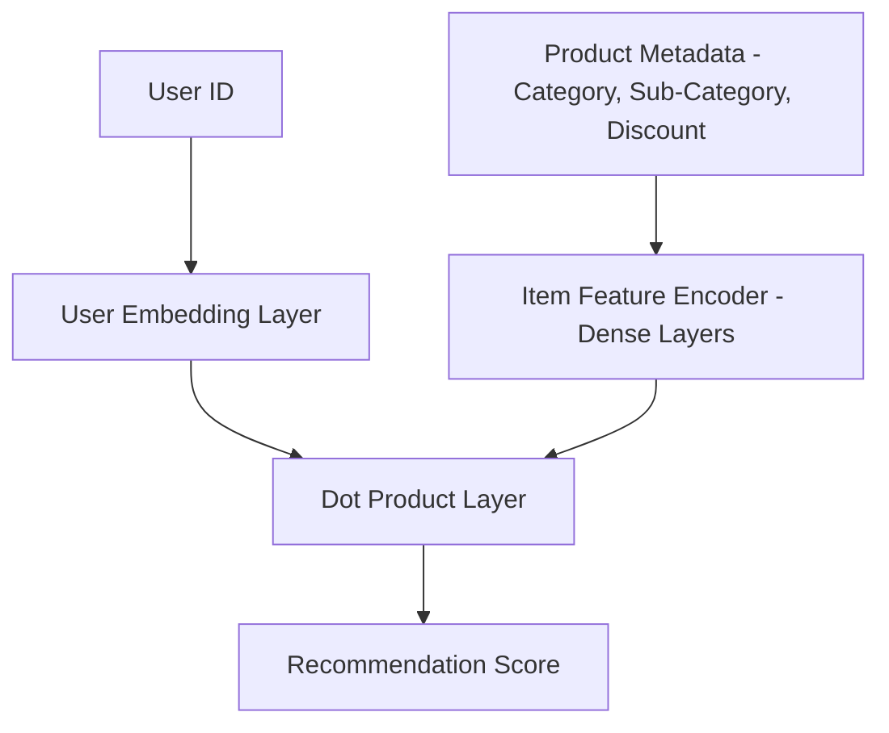
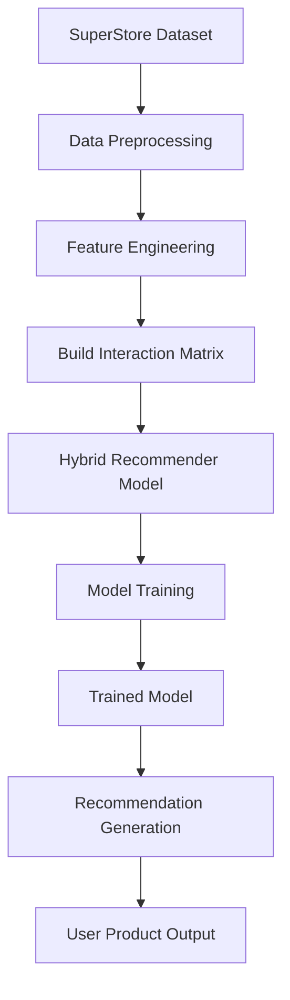

# 🧠 SuperStore AI Recommender System  
**Hyper-Personalized Deep Learning Recommendations for Retail Analytics**

---

## 📦 Overview

This project presents a **deep learning–powered hybrid recommender system** built using the [SuperStore Dataset](https://www.kaggle.com/datasets/vivek468/superstore-dataset-final) from Kaggle. Using customer purchase history and product metadata, we train a neural network that intelligently suggests new products for customers based on their past behavior and product characteristics.

> 💡 Ideal for showcasing modern recommendation techniques in retail analytics, e-commerce personalization, and customer segmentation.

---

## 🧾 About the Dataset

**🗂 Source**: [Kaggle - SuperStore Dataset (Final)](https://www.kaggle.com/datasets/vivek468/superstore-dataset-final)  
**📊 Format**: Excel (.xlsx)  
**📍 Context**: A Superstore giant wants to understand what products, categories, regions, and customer segments are driving performance—and which ones are not. This dataset is commonly used in business intelligence tools like Tableau.

### 🧬 Key Features

- **Customers**: `Customer ID`, `Segment`, `Region`, `State`, etc.
- **Orders**: `Order Date`, `Ship Mode`, `Sales`, `Profit`, `Discount`
- **Products**: `Product ID`, `Category`, `Sub-Category`, `Product Name`
- **Goal**: Use this data to power a hybrid recommender system based on both collaborative and content-based filtering.

---

## 🔍 Use Case

> **Build a Recommendation Engine** that answers:
- What products should we recommend to each customer?
- Can we personalize marketing based on user behavior?
- Which item features (e.g., category, discount) influence purchases?

---

## 🧠 Model Architecture



---

## 🧠 Workflow



### ✅ Hybrid Benefits

* Captures user preferences and item semantics
* Learns from both interactions and metadata
* Handles cold start problems for new products

---

## 📊 Sample Output

```python
get_user_product_status_df('CG-12520', top_k=5)
```

| Product ID      | Product Name                   | Status               |
| --------------- | ------------------------------ | -------------------- |
| OFF-PA-10002557 | PaperPro Antimicrobial Stapler | purchased previously |
| OFF-BI-10002929 | Sharpie Highlighters, Chisel   | predicted            |
| FUR-CH-10003963 | Global Ergonomic Chair         | predicted            |

---

## 🛠️ Tech Stack

* **Python 3.10**
* **TensorFlow / Keras**
* **Pandas / NumPy**
* **Scikit-learn**

---

## 🚀 Getting Started

### 🔧 Installation

```bash
pip install pandas numpy tensorflow scikit-learn
```

### 💻 Running the Code

```bash
python your_script.py
```

---

## 🗃️ Project Structure

```
📁 SuperStore-Recommender/
├── Superstore.xlsx
├── main.py
├── .gitignore
├── hybrid_recommender_model.h5
└── README.md
```

---

## 💡 Business Value

This project demonstrates how data science and AI can support:

* 🎯 **Targeted Marketing**: Suggest relevant items to increase conversions.
* 📈 **Sales Optimization**: Identify product categories that drive repeat purchases.
* 🤝 **Customer Retention**: Personalize user experience to boost satisfaction.

---

## 🧠 Future Improvements

* [ ] Add regression models to predict **Sales** or **Profit**
* [ ] Integrate user segmentation (e.g., Segment, Region)
* [ ] Build a Streamlit or Flask app for live recommendations
* [ ] Incorporate time-based features for trend analysis

---

## 🏁 Acknowledgements

> 📌 *"I do not own this dataset. Data sourced from Tableau and uploaded to Kaggle by the community. For educational purposes only."*


---

## 🌟 Like It? Star It!

If you found this project insightful or inspiring, drop a ⭐ and share it with fellow data scientists!
